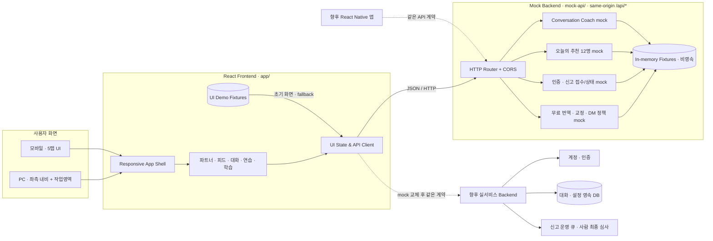
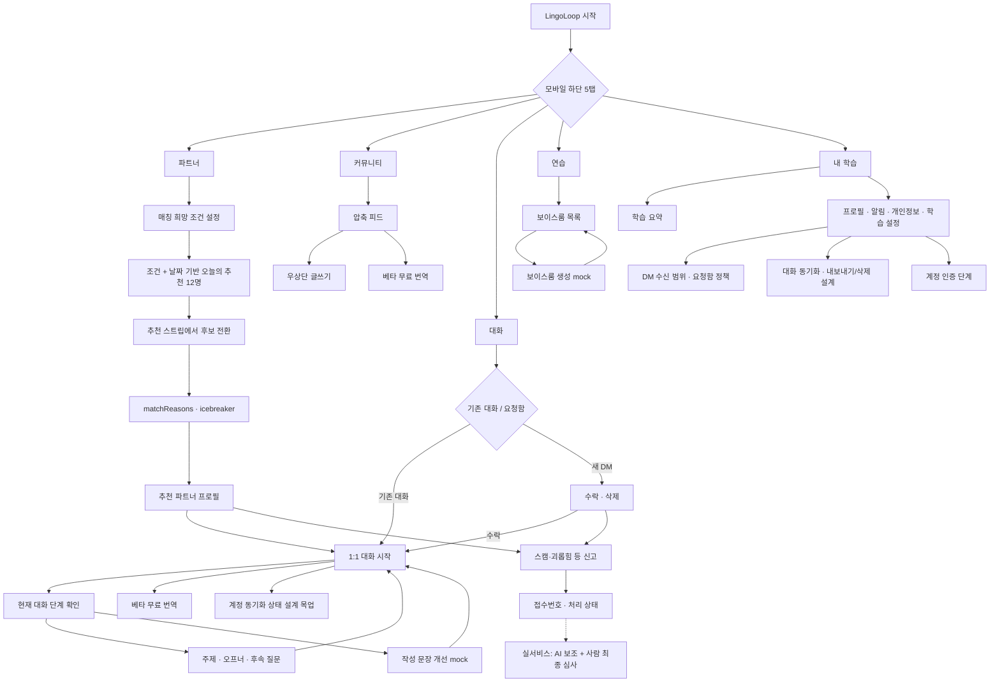

# LingoLoop

언어를 **공부하는 사람끼리 서로 가르치고 배우는 경험**을 웹에서 검증하기 위한 반응형 언어교환 mock입니다. HelloTalk의 공개된 공식 기능 설명에서 파트너 탐색, 대화 중 번역·교정, 커뮤니티 피드, 보이스룸/라이브 같은 제품 패턴을 조사한 뒤, 독립 브랜드 **LingoLoop**의 PC·모바일 경험으로 다시 설계했습니다.

> [!IMPORTANT]
> LingoLoop는 HelloTalk과 제휴·후원·승인 관계가 없는 독립적인 학습용 프로토타입입니다. HelloTalk의 상표, 로고, 화면, 문구, 소스 코드, 실제 사용자 데이터는 사용하지 않습니다. 이 저장소의 프로필·게시물·대화는 모두 가상 데이터입니다.

## 현재 범위

이 버전의 목표는 실제 서비스 구축 전 제품 구조와 핵심 상호작용을 빠르게 검증하는 것입니다. 프런트엔드와 mock 백엔드를 분리했으며, 별도 인프라나 외부 서비스 없이 로컬에서 실행할 수 있습니다.

- PC: 좌측 내비게이션과 넓은 중앙 작업 영역으로 단순화한 2영역 레이아웃
- 모바일: `파트너 / 커뮤니티 / 대화 / 연습 / 내 학습`의 하단 5탭 레이아웃
- 반응형 SPA: 같은 도메인 상태와 API 계약을 공유하되 화면 크기에 맞춰 정보 밀도와 내비게이션을 변경
- mock backend: 메모리 기반 가상 데이터와 결정론적 매칭·대화 지원·번역·교정 응답을 독립 API로 제공
- 모바일 확장성: 이후 React Native 앱이 같은 API 계약과 도메인 모델을 재사용할 수 있도록 UI와 데이터 경계를 분리

현재 UI는 다섯 핵심 탭에 집중합니다. 파트너 탭은 조건과 날짜를 기준으로 **오늘의 추천 12명**을 보여주며, 대화 탭은 기존 대화와 새로운 DM 요청을 분리합니다. 피드와 DM의 번역은 언어 장벽을 낮추기 위해 베타 기간 무료로 제공한다는 제품 정책을 목업에 표시합니다. 결제·광고·VIP 권한 검증 자체는 아직 구현하지 않았습니다.

HelloTalk의 공식 자료는 모바일 앱의 핵심 탭과 기능을 중심으로 설명합니다. 따라서 이 프로젝트의 PC 화면은 해당 웹 화면을 복제한 것이 아니라, 같은 언어교환 과업을 넓은 작업 영역에 맞춰 재구성한 LingoLoop 고유 설계입니다.

## 구현 기능

| 영역 | 제공하는 mock 경험 |
| --- | --- |
| 파트너 | 희망 언어·수준·시간대·관심사·연령대·성별 선호·만남 목적·인증 여부 조건 설정, 조건과 날짜를 seed로 한 **오늘의 추천 12명**, `matchReasons`·`icebreaker`, 프로필과 대화 시작 |
| 커뮤니티 | 정보를 빠르게 훑는 압축 피드, 화면 우상단 글쓰기 버튼, 베타 기간 무료 번역 안내를 통한 게시물 작성·읽기 |
| 대화 | 모바일 하단 5탭에 유지되는 1:1·그룹 대화, `매칭·맞팔 / 내 차례 / 요청함` 분리, DM 수신 범위 설정과 요청 수락·삭제 흐름 |
| 대화 코치 | 대화 단계에 맞는 주제·오프너·후속 질문 추천과 작성 중인 문장의 규칙 기반 개선 mock |
| 연습 | 보이스룸 목록·생성, 준비된 방의 입장·손들기 상태 mock만 제공. 라이브·클래스 카탈로그는 제외 |
| 내 학습 | 간단한 학습 요약, 프로필·알림·개인정보·학습 설정, DM 수신 정책, 계정 기반 대화 동기화의 상태·데이터 관리 설계 목업 |
| 신뢰·안전 | 인증 단계 표시, 스캠을 포함한 신고 사유, 신고 접수번호·처리 상태 안내, 신고자 보호와 **사람의 최종 심사** 원칙 |

매칭, 대화 코치, 번역, 교정, DM 요청, 인증·신고 상태와 보이스룸 생성은 사용자 흐름을 확인하기 위한 UI/API 시뮬레이션입니다. 데일리 추천은 고정 fixture와 결정론적 규칙, 대화 지원은 준비된 규칙·템플릿으로 생성되며 실제 AI/ML 추천이나 생성형 AI가 아닙니다. 음성 인식, WebRTC, 푸시 알림, 계정 인증기관, 운영자 심사 시스템과도 연결되어 있지 않습니다.

> [!NOTE]
> “계정에 대화 동기화”, “인증 완료”, “신고 처리 상태”는 실서비스의 목표 UX를 검증하기 위한 설계 목업입니다. 현재 mock backend는 데이터베이스가 없는 메모리 fixture이므로 새로고침·서버 재시작·재로그인·다른 기기에서 메시지나 설정을 실제로 복원하지 않습니다.

## 빠른 시작

### 요구 사항

- Node.js `>= 22.13.0`
- npm

### 설치 및 실행

```bash
npm install
npm run dev
```

기본 주소는 `http://localhost:5173`입니다. 같은 origin의 `/api/*` 요청이 mock backend로 라우팅되므로 별도 API 프로세스, 데이터베이스, 클라우드 계정은 필요하지 않습니다.

### 검증

```bash
npm run typecheck
npm run lint
npm test
npm run build
```

## npm scripts

| 명령 | 설명 |
| --- | --- |
| `npm run dev` | 프런트엔드와 로컬 mock API 개발 서버 실행 |
| `npm run build` | 배포 가능한 프로덕션 번들 생성 |
| `npm run typecheck` | TypeScript 정적 타입 검사 |
| `npm run lint` | ESLint 규칙 검사 |
| `npm test` | 렌더링 및 핵심 mock 동작 테스트 |

## Mock API

mock backend는 프런트엔드와 독립된 네트워크 계약을 제공합니다. 현재 화면은 즉시 실행되고 API 장애 중에도 탐색할 수 있도록 `app/lib/demo-data.ts`의 UI fixture로 먼저 렌더링하며, 시작 시 주요 조회 endpoint의 상태를 확인하고 메시지·신고 같은 동작에서 API를 호출합니다. API 응답은 `{ data, meta }` 또는 `{ error, meta }` 형태의 JSON이며, 같은 origin으로 실행하되 CORS preflight를 위한 `OPTIONS` 요청도 처리합니다.

| Method | Endpoint | 용도 |
| --- | --- | --- |
| `GET` | `/api/health` | mock 서버 상태 확인 |
| `GET` | `/api/bootstrap` | 현재 사용자, 알림, 요약 지표 등 초기 화면 데이터 |
| `GET` | `/api/partners` | 내부 mock용 파트너 fixture 조회 |
| `GET` | `/api/posts` | 커뮤니티 게시물 목록 |
| `GET` | `/api/conversations` | 1:1·그룹 대화 목록 |
| `GET` | `/api/conversations/:id` | 특정 대화와 메시지 조회 |
| `GET` | `/api/conversations/:id/messages` | 특정 대화의 메시지만 조회 |
| `GET` | `/api/corrections` | 게시물·메시지 교정 내역 |
| `GET` | `/api/rooms` | 보이스룸 목록 조회 |
| `GET` | `/api/notifications` | 알림 목록 |
| `GET` | `/api/profile` | 현재 mock 사용자 프로필 |
| `GET` | `/api/languages` | 지원 언어 fixture 목록 |
| `GET` | `/api/search?q=...` | 파트너·게시물 통합 검색 |
| `GET` | `/api/matching/preferences` | 현재 매칭 희망 조건 조회 |
| `POST` | `/api/matching/preferences` | 언어·수준·시간대·관심사·성별 선호·연령대·교류 목적·인증 여부 조건 검증 |
| `GET` | `/api/matching/daily` | 조건과 날짜 기반의 결정론적 오늘의 추천 **12명**. 각 항목에 `matchReasons`·`icebreaker`·조건 충족 여부 포함 |
| `POST` | `/api/conversation-support` | 대화 단계별 주제·오프너·후속 질문 또는 작성 문장 개선 결과 생성 |
| `POST` | `/api/messages` | 텍스트·보이스 메시지 전송 결과 생성 |
| `POST` | `/api/translate` | 입력 문장의 가상 번역과 무료·비과금 정책 메타데이터 생성 |
| `GET` | `/api/dm/privacy` | DM 수신 범위, 요청함 분기, 스팸 필터 등 개인정보 설정 조회 |
| `POST` | `/api/dm/privacy` | DM 개인정보 설정 검증·프로세스 메모리 반영 |
| `GET` | `/api/dm/requests` | 상태별 DM 요청함 목록 조회 |
| `POST` | `/api/dm/requests` | 요청 수락·거절·차단 상태 전환 mock |
| `GET` | `/api/dm/sync` | 계정 기반 자동 동기화·재설치 복원·보관 정책의 목표 계약 조회. 실제 저장은 하지 않음 |
| `POST` | `/api/corrections` | 문장 교정 제안 결과 생성 |
| `GET` | `/api/account/verification` | 현재 계정의 인증 단계·활성화 가능 상태 조회 |
| `POST` | `/api/account/verification` | 이메일·전화번호·신원 인증 시작/완료 상태 전환 mock |
| `GET` | `/api/reports` | 내가 제출한 신고 접수·처리 상태 목록 조회 |
| `GET` | `/api/reports/:id` | 신고 접수번호별 상태 이력 조회 |
| `POST` | `/api/reports` | 사용자 또는 콘텐츠 신고 접수. 스캠 사유, 신고자 계정 유지 상태와 다음 안내 시각 포함 |
| `OPTIONS` | `/api/*` | 로컬 프런트엔드용 CORS preflight |

목록 endpoint는 `cursor`, `limit` query를 받으며 `limit`은 최대 50입니다. 주요 필터는 다음과 같습니다.

- 파트너 fixture: `q`, `nativeLanguage`, `learningLanguage`, `status`(현재 UI에는 전체 목록 필터를 노출하지 않음)
- 게시물: `language`, `authorId`, `tag`
- 대화: `unread=true`
- 교정: `sourceId`, `sourceType`

`/api/matching/daily`는 같은 날짜와 같은 희망 조건에 대해 같은 순서의 추천 12명과 추천 근거를 돌려주는 mock입니다. 모든 조건을 만족하는 후보가 부족하면 일부 조건을 넓힌 후보를 뒤에 배치하고 그 사실을 `matchReasons`로 알립니다. `/api/conversation-support`는 대화 단계와 입력 문장에 따라 미리 정의된 규칙·템플릿을 선택합니다. 두 기능 모두 실제 행동 데이터를 학습하거나 외부 AI 모델을 호출하지 않습니다.

쓰기 endpoint는 입력을 검증하고 성공 응답 또는 현재 프로세스 안의 임시 상태를 만들지만 서버에는 영속 저장하지 않습니다. 웹 UI의 매칭 희망 조건 등 일부 설정만 현재 기기의 `localStorage`에 보관되며, 다른 기기·브라우저와 동기화되지 않습니다. `/api/dm/sync`가 반환하는 자동 동기화·재설치 복원 정보는 향후 실서비스 계약을 보여주는 목업으로, 현재 동작을 보장하는 상태가 아닙니다.

신고 API의 상태 이력도 프로세스 메모리 fixture입니다. `received` 이후의 실제 조사·제재는 수행하지 않으며, AI 자동 정지를 뜻하지 않습니다. 제품 원칙상 AI는 분류와 요약을 보조하고 계정 정지 같은 중대한 결정은 사람 담당자가 최종 확인합니다.

보이스룸 생성은 현재 프런트엔드의 로컬 UI mock입니다. 별도의 생성 API나 저장소는 없으며 `GET /api/rooms`는 준비된 목록만 반환합니다.

## 시스템 구성도



목표 경계는 `React UI → API client → HTTP mock API`입니다. 현재는 제품 데모의 복원력을 위해 프런트엔드 fixture와 서버 fixture를 함께 두고 API 연결 상태를 표시합니다. 다음 단계에서 조회 결과로 화면 상태를 hydrate하고 공유 schema를 도입하면, mock 서버를 실서비스 API로 바꾸거나 React Native 클라이언트를 추가할 때 UI 변경 범위를 줄일 수 있습니다.

## 사용자 흐름



## 기술 스택

| 구분 | 기술 |
| --- | --- |
| UI | React 19, React DOM, TypeScript |
| 앱 프레임워크 | vinext 기반 App Router, Vite |
| 스타일 | 반응형 CSS, 모바일·데스크톱 전용 레이아웃 |
| Mock backend | Worker-compatible Fetch API router, JSON, 메모리 fixture |
| 배포 어댑터 | Cloudflare Worker 엔트리포인트(현재 인프라 구성은 범위 밖) |
| 품질 | ESLint, TypeScript, Node test runner |
| 향후 데이터 계층 | 현재 없음. 실서비스 단계에서 제품 요구에 맞춰 선택 |

## 프런트엔드와 mock 백엔드의 분리

| 관심사 | Frontend | Mock backend |
| --- | --- | --- |
| 책임 | 반응형 렌더링, 내비게이션, 상호작용, UI fixture·로컬 상태, API 상태 확인 | 데이터 조회 계약, 입력 검증, 추천·무료 번역·교정·DM 정책·인증·신고 상태 시뮬레이션 |
| 위치 | `app/`, `public/` | `mock-api/` |
| 통신 | API client가 같은 origin의 `/api/*`로 JSON 요청 | Worker가 API 요청을 분기하고 JSON 응답 |
| 교체 전략 | React Native에서도 도메인/API 타입 재사용 | 실제 인증·DB·AI·실시간 서버로 대체 |

현재는 제품 mock이므로 영속 저장소·실제 인증·실시간 채널이 없고, 일부 UI 동작은 로컬 또는 실행 중인 프로세스 상태만 갱신합니다. 별도의 API 경계를 함께 제공하므로 다음 단계에서 OpenAPI 또는 공유 TypeScript schema로 계약을 고정하고 화면 데이터를 서버 응답으로 단계적으로 전환할 수 있습니다.

## 폴더 구조

```text
matchOP/
├── app/
│   ├── components/          # 화면·기능별 React 컴포넌트
│   ├── lib/                 # 프런트엔드용 타입과 즉시 렌더링용 데모 데이터
│   ├── globals.css          # 디자인 토큰과 반응형 스타일
│   ├── layout.tsx           # 문서 셸과 메타데이터
│   └── page.tsx             # LingoLoop SPA 진입점
├── mock-api/
│   ├── data.ts              # 사용자·피드·대화·룸 fixture와 타입
│   └── router.ts            # 검증, CORS, pagination, JSON API router
├── public/                  # 정적 이미지·아이콘 자산
├── tests/                   # 렌더링 및 동작 검증
├── worker/
│   └── index.ts             # vinext/Cloudflare Worker 엔트리포인트
├── .openai/hosting.json     # 현재 비어 있는 선택적 호스팅 바인딩 선언
├── package.json             # 실행·검증 scripts와 의존성
├── vite.config.ts           # vinext/Vite 로컬 개발 구성
└── README.md
```

## Mock의 한계

- 계정 생성·로그인·세션 검증은 실제 인증이 아닙니다. 인증 배지와 이메일·전화번호 인증 단계는 fixture이며 SMS 발송, 신원 확인, 재가입 방지 시스템과 연결되지 않습니다.
- 프로필, 게시물, 대화, DM 요청, 알림과 신고는 가상 데이터입니다. API가 성공 응답이나 프로세스 메모리의 변경 상태를 만들 수는 있지만 영속 데이터베이스에 저장하지 않으며 서버를 다시 시작하면 초기화됩니다.
- 초기 목록은 프런트엔드 fixture로 렌더링됩니다. 모든 조회 endpoint 결과가 화면 상태를 직접 hydrate하는 단계는 아직 아닙니다.
- 매칭 희망 조건은 현재 브라우저의 `localStorage`와 mock 상태에만 머뭅니다. 오늘의 추천 12명은 날짜·조건과 고정 fixture를 조합한 결정론적 결과로, 실제 사용자의 행동·친밀도·안전 신호를 학습하는 추천 모델이 아닙니다.
- `matchReasons`와 `icebreaker`는 추천 결과를 설명하고 첫 대화를 돕는 예시 문구이며, 상대방과의 실제 적합성이나 응답 가능성을 보장하지 않습니다.
- DM 수신 범위와 요청함은 정보 구조 및 수락·삭제·차단 흐름을 검증하는 mock입니다. 실제 팔로우·매칭 관계 확인, 메시지 전달 권한 강제, 스팸 탐지, rate limit은 구현하지 않았습니다.
- “계정에 대화 동기화됨” 상태와 대화 내보내기·삭제 제어는 목표 설계입니다. 현재 메시지는 계정 단위로 서버에 자동 백업되지 않으므로 앱 삭제·재로그인·브라우저 변경 뒤 복원을 보장하지 않습니다.
- 대화 코치는 단계별 규칙과 준비된 템플릿을 사용합니다. 실제 생성형 AI, 전체 대화 맥락 추론, 장기 기억, 원어민 수준의 문장 품질 보장은 제공하지 않습니다.
- 무료 번역 표시는 베타 제품 정책 목업이며 실제 과금 계정·사용량 계측·VIP entitlement가 없습니다. 번역·교정 결과도 데모 규칙 또는 준비된 응답으로 AI 품질을 나타내지 않습니다.
- 커뮤니티는 압축 피드와 우상단 글쓰기 흐름만 검증하며, 작성한 게시물은 실서비스 저장소에 보존되지 않습니다.
- 연습 탭은 보이스룸 목록·생성과 준비된 방의 입장·손들기 상태만 흉내 냅니다. 실제 음성 발언, 녹음, 스트리밍, WebRTC, STT/TTS는 없습니다.
- 신고 접수번호·진행 상태와 신고자 계정 보호 문구는 투명한 CS 흐름을 검증하는 mock입니다. 실제 증거 보존, 운영자 큐, 자동 모더레이션, 긴급 대응, 이의제기와 법적 보존 정책에는 연결되지 않으며 어떤 계정도 실제로 제재하지 않습니다.
- AI는 향후 신고 분류·중복 탐지·요약을 보조할 수 있지만, 영구 정지 같은 중대한 제재는 사람 담당자가 근거를 확인하고 최종 결정한다는 원칙만 문서와 UI에 표현합니다. 현재는 AI 심사와 사람 심사 모두 실행되지 않습니다.
- 내 학습은 요약과 프로필·알림·개인정보·학습 설정만 제공하며, 상세 분석이나 별도 학습 콘텐츠는 범위 밖입니다.
- 오프라인 동기화, 실제 자동 백업, 푸시 알림, 파일 업로드, 다중 기기 동기화, 실시간 presence는 구현 범위 밖입니다.
- 프로덕션 수준의 보안, 개인정보 동의, 연령 분리, 접근성·국제화 검증을 완료한 서비스가 아닙니다.

## React Native 및 실서비스 전환 로드맵

1. **API 계약 고정 및 완전 연결**
   OpenAPI 또는 공유 TypeScript schema로 추천 목록, DM 정책·요청 상태, 대화 동기화, 인증·신고 상태와 오류 형식을 명시하고 모든 화면을 API 조회 결과로 hydrate합니다.
2. **계정·인증 기반 구축**
   안전한 세션과 이메일·전화번호의 단계적 인증을 도입합니다. 인증 범위를 배지에 정확히 표시하고, 고위험 행동에만 추가 확인을 요구해 가입 마찰과 스캠 방지 사이의 균형을 검증합니다.
3. **대화 영속화와 다중 기기 동기화**
   관계형 DB를 대화의 기준 데이터로 삼고 cursor pagination, idempotent 전송, 읽음 상태와 충돌 처리를 구현합니다. 보관 기간, 계정별 내보내기·삭제, 탈퇴 후 처리와 백업 복구 절차도 함께 확정합니다.
4. **DM 개인정보·스팸 방어**
   매칭·상호 팔로우 관계에 따라 수신 권한을 서버에서 강제하고, 나머지는 요청함으로 격리합니다. 수락 전 링크·미디어 제한, rate limit과 위험 신호 탐지를 추가합니다.
5. **React Native 클라이언트**
   모바일 5탭 구조와 같은 API 계약을 네이티브 내비게이션으로 옮기고 카메라, 마이크, 알림, 딥링크와 안전한 로컬 캐시를 구현합니다.
6. **번역 우선의 점진적 수익화**
   기본 번역은 최대한 무료로 유지하고 초기 출시 기간에는 결제 없이 사용량을 관찰합니다. 이후 AI 코치·추가 추천 같은 선택 기능의 한도를 투명하게 고지한 뒤 VIP 또는 광고 보상 실험을 별도 feature flag로 진행합니다.
7. **Trust & Safety 및 CS**
   스캠·사칭·괴롭힘 신고 증거, 접수번호, 상태 이력, 차단 강제, 이의제기, 감사 로그와 보존 절차를 구축합니다. AI는 우선순위 분류와 요약만 보조하며 중대한 제재는 사람 담당자가 최종 심사합니다.
8. **언어 학습·미디어 서비스**
   번역·교정 모델, STT/TTS, WebRTC 통화·보이스룸, 콘텐츠 업로드와 처리 파이프라인을 도입합니다.
9. **운영 준비**
   관측성, 백업, CI/CD, 부하·보안·접근성 테스트, 다국어 번역 운영을 완료한 뒤 점진적으로 출시합니다.

인프라 선택은 이 mock 단계의 의도적인 범위 밖입니다. API 계약과 기능 경계가 안정된 뒤 사용량, 지역, 개인정보 요구 사항을 기준으로 결정합니다.

## HelloTalk 공식 자료 조사

아래 자료는 2026-08-11에 확인했습니다. 기능의 존재와 일반적인 사용자 패턴을 이해하기 위한 참고 자료이며, LingoLoop의 명칭·UI·구현은 독립적으로 제작했습니다.

- [About HelloTalk](https://www.hellotalk.com/en/about): 네이티브 화자와의 실제 대화, 문화 교류, 교정, 라이브 학습이라는 서비스 방향
- [HelloTalk 기능 개요](https://www.hellotalk.com/en/features): 채팅, 파트너 매칭, 커뮤니티 피드, 보이스룸, 라이브, 번역의 전체 기능군
- [Navigating HelloTalk](https://creators.hellotalk.com/article/navigating-hellotalk): Chats, Moments, Connect, Live, Me로 이어지는 공식 앱 탐색 구조
- [Chat & Messaging](https://www.hellotalk.com/en/features/chat): 텍스트·음성·영상 대화와 번역·교정·전사 학습 도구
- [Language Exchange Partners](https://www.hellotalk.com/en/features/language-exchange): 학습 목표, 관심사, 시간대, 언어 수준을 고려한 파트너 발견 패턴
- [What is Language Exchange?](https://www.hellotalk.com/en/faq/chats-learning-features/293): 두 언어를 번갈아 연습하는 예약형 교환 통화 패턴
- [What are Voicerooms?](https://www.hellotalk.com/en/faq/live-and-voiceroom/403): 여러 학습자가 실시간으로 듣기·말하기를 연습하는 오디오 이벤트
- [Translation](https://www.hellotalk.com/en/features/translation): 대화 맥락 안의 텍스트·음성·이미지 번역과 학습 보조 패턴
- [Community Guidelines](https://www.hellotalk.com/community-guidelines): 상호 존중, 도움, 신고·차단과 운영 안전의 중요성

## 라이선스·브랜드 안내

이 프로토타입을 공개하거나 상용화하기 전에는 저장소 라이선스, 개인정보 처리방침, 이용약관, 커뮤니티 정책을 별도로 확정해야 합니다. **HelloTalk**은 해당 권리자의 상표이며, **LingoLoop**는 이 mock에서 사용하는 독립적인 프로젝트명입니다.
