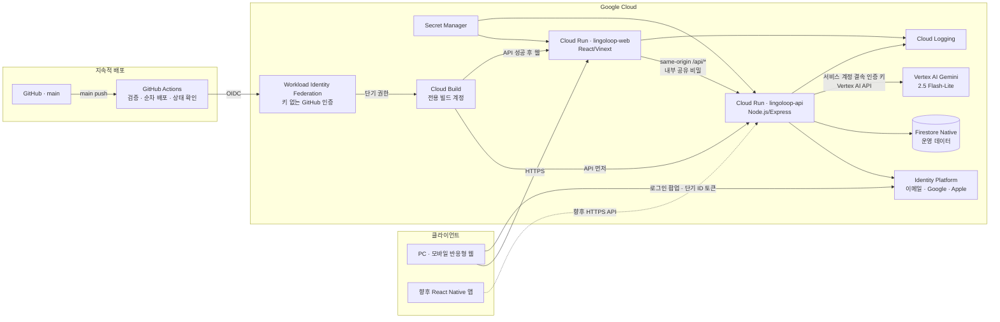

# LingoLoop

LingoLoop는 언어 교환 파트너를 찾고, 커뮤니티 글과 1:1 대화를 이어가는 반응형 웹 서비스입니다. PC와 모바일이 같은 API를 사용하며, 현재 운영 경로는 **Google Cloud Identity Platform + Firestore에 실제 계정과 데이터를 저장하는 구조**입니다.

> [!IMPORTANT]
> LingoLoop는 HelloTalk과 제휴·후원·승인 관계가 없는 독립 서비스입니다. HelloTalk의 상표, 로고, 문구, 소스 코드나 사용자 데이터를 사용하지 않습니다.

> [!NOTE]
> 이 저장소는 더 이상 메모리 fixture를 운영 데이터처럼 보여주는 mock 런타임을 사용하지 않습니다. 다만 아래의 “아직 연결하지 않은 기능”까지 완성된 것은 아닙니다.

## 현재 제공 범위

### 실제 계정·영속 데이터로 동작

| 영역 | 현재 동작 |
| --- | --- |
| 로그인 | Identity Platform 이메일·비밀번호, Google/Apple 연결 코드와 Firebase Admin 세션 쿠키. 소셜 공급자는 운영 자격정보 설정 후 활성화 |
| 프로필 | 이름, 소개, 모국어, 학습 언어 등 Firestore 저장·수정 |
| 매칭 | 실제 가입자 프로필과 저장된 선호 조건으로 일일 추천 생성·저장 |
| 커뮤니티 | 게시물 작성·조회·좋아요를 Firestore에 영속 저장 |
| 대화 | 대화방 생성, 메시지 전송·조회, 재로그인 후 복원 |
| DM 정책 | 수신 범위 설정 저장, 매칭·좋아요·팔로우 관계 확인, 허용되지 않은 DM의 요청함 분기 또는 차단 |
| 신고 | 신고 내용과 처리 상태를 Firestore에 접수·조회 |
| AI 지원 | Gemini 2.5 Flash-Lite 번역, 메시지별 번역 보기, 대화 주제·추천 문장 지원 |

API 성공 응답에는 다음 메타데이터가 포함됩니다.

```json
{
  "meta": {
    "mock": false,
    "persistent": true
  }
}
```

### 아직 연결하지 않은 기능

- 음성 대화(보이스룸, WebRTC/SFU). Phase 1 범위에서 제외했습니다.
- 전화번호·신분증 인증. 현재 실제 인증 상태는 이메일 인증까지만 확인
- 모바일 푸시 알림과 네이티브 앱
- 영어·일본어 UI. 운영 데이터 전환 화면은 현재 한국어 MVP이며 기존 다국어 사전과 통합 예정
- 결제, VIP 권한, 광고 보상. 초기 제품 정책에 따라 의도적으로 제외
- 운영자용 신고 심사 화면, 자동 제재, 이의제기·긴급 대응 워크플로
- WebSocket 기반 실시간 전달. 현재 대화 화면은 주기적으로 새 메시지를 조회
- 정교한 스팸·스캠 탐지, 기기 지문, 다단계 rate limit과 콘텐츠 모더레이션
- Gemini 인증 키가 없는 개발 환경에서는 번역·대화 지원 API가 가짜 결과 대신 `503`을 반환

즉, 계정·프로필·게시물·대화·매칭 설정은 실제 저장되지만 “앱 출시 준비 완료”를 뜻하지는 않습니다. 개인정보 처리방침, 이용약관, 데이터 보존·삭제 정책, CS 운영, 보안 점검과 스토어 심사는 별도로 완료해야 합니다.

## 운영 시스템 구성도



브라우저의 일반 데이터 요청은 모두 웹 서비스의 same-origin `/api/*` 프록시를 거쳐 API 서비스로 전달됩니다. 소셜 로그인 때만 Firebase 웹 SDK가 Identity Platform에서 짧게 유효한 ID 토큰을 받고, 이를 API가 최대 14일의 `HttpOnly` 세션 쿠키로 교환합니다. Firebase 웹 API 키와 프로젝트 식별자는 공개 클라이언트 설정이며 인증 비밀이 아닙니다. OAuth Client Secret, Gemini 키와 프록시 공유 비밀은 브라우저에 노출하지 않습니다. API 서비스만 전용 서비스 계정으로 Firestore를 사용합니다.

## 데이터 모델

주요 Firestore 컬렉션은 다음과 같습니다.

```text
profiles/{uid}
matchingPreferences/{uid}
dailyMatches/{uid}/days/{yyyy-mm-dd}
likes/{fromUid_toUid}
follows/{fromUid_toUid}
posts/{postId}
posts/{postId}/reactions/{uid}
posts/{postId}/replies/{replyId}
savedPhrases/{uid}/items/{itemId}
conversations/{conversationId}
conversations/{conversationId}/messages/{messageId}
dmPolicies/{uid}
blocks/{blockerUid_blockedUid}
reports/{reportId}
aiUsage/{uid}/days/{yyyy-mm-dd}
```

- 사용자 문서는 Identity Platform의 `uid`를 기준으로 연결합니다.
- 대화방은 참여자 UID를 보관하고 API가 매 요청마다 참여 여부를 확인합니다.
- 새 DM은 수신자의 정책과 매칭·좋아요·팔로우 관계를 검사해 대화 또는 요청함으로 저장합니다.
- 메시지는 대화방 하위 컬렉션에 저장되므로 앱 삭제·재설치 후에도 같은 계정으로 조회할 수 있습니다.
- 일일 매칭은 날짜와 선호 조건을 기준으로 생성한 스냅샷을 저장합니다. 조건을 만족하는 실제 가입자가 없으면 가상 파트너를 보여주지 않고 빈 상태를 반환합니다.
- 룸 문서는 음성 연결 자체가 아니라 목록과 참가 상태를 위한 메타데이터입니다.
- 무료 베타 AI 사용량은 사용자·서울 날짜별로 저장하며 기본 한도는 번역 100회, 대화 지원 30회입니다.

운영 모델은 Google이 안정 버전 중 가장 비용 효율적인 모델로 안내하는 `gemini-2.5-flash-lite`입니다. 표준 유료 요금은 2026-08 기준 텍스트 입력 100만 토큰당 USD 0.10, 출력 100만 토큰당 USD 0.40이며, 경량 번역·추천에는 사고 토큰이 발생하지 않도록 `thinkingBudget: 0`을 사용합니다. Vertex AI는 이 모델의 종료일을 **2026-10-20**으로 안내하므로 그 전에 다음 Flash-Lite 안정 모델로 전환해야 합니다. 배포 전 [공식 가격표](https://cloud.google.com/vertex-ai/generative-ai/pricing)와 [모델 수명 주기](https://cloud.google.com/vertex-ai/generative-ai/docs/models/gemini/2-5-flash-lite)를 다시 확인합니다.

## 인증과 보안 경계

- 이메일 회원가입·로그인은 서버가 Identity Platform REST API와 통신합니다.
- Google·Apple 로그인은 Firebase 웹 SDK의 팝업으로 받은 ID 토큰을 `POST /api/auth/session`에서 검증한 뒤 같은 보안 세션 쿠키로 교환합니다. Firebase 클라이언트 로그인 상태는 메모리에만 두고 교환 직후 제거합니다.
- 로그인 성공 후 최대 14일의 `HttpOnly`, `Secure`, `SameSite=Lax` 세션 쿠키를 발급합니다.
- `/api/*`는 웹 프록시의 `x-lingoloop-proxy` 공유 비밀을 요구합니다. `/healthz/`만 인프라 상태 확인을 위해 공개합니다.
- 상태를 바꾸는 요청은 허용된 `APP_ORIGIN`을 검사하며 JSON 본문은 64KB로 제한합니다.
- API 키와 공유 비밀은 이미지나 Git에 넣지 않고 Secret Manager에서 런타임에 주입합니다.
- Gemini 인증 키는 API 런타임 서비스 계정에 결속되고 Vertex AI API로 제한하며, Secret Manager에서 API 서비스에만 주입합니다.
- LingoLoop는 AI 요청·응답을 별도 컬렉션에 저장하지 않고 일일 사용 횟수만 기록합니다. 사용자가 보낸 메시지는 기존 대화 보존 정책에 따라 Firestore에 저장되며, Gemini 측 데이터 처리는 선택한 유료 API 약관을 따릅니다.
- Cloud Run API 서비스 계정에는 필요한 최소 Firestore·Identity 권한만 부여해야 합니다.

공유 비밀은 브라우저 사용자를 인증하는 수단이 아닙니다. 사용자 권한 검사는 반드시 검증된 세션 쿠키와 리소스 소유권으로 수행합니다.

## API

모든 애플리케이션 API는 JSON을 사용하며, 별도 표기가 없으면 로그인 세션이 필요합니다. `/healthz/`는 Cloud Run이 직접 확인하는 공개 상태 endpoint입니다. `/api/health`, `/api/languages`와 인증 시작 endpoint는 사용자 세션 없이 호출할 수 있지만 `/api/*`의 웹 프록시 공유 비밀은 계속 필요합니다.

| Method | Endpoint | 용도 |
| --- | --- | --- |
| `GET` | `/healthz/` | API 프로세스와 Firestore 연결 상태 확인 |
| `GET` | `/api/health` | 운영 API·AI 구성 상태 확인 |
| `GET` | `/api/auth/config` | 공개 Firebase 설정과 활성 소셜 공급자 조회 |
| `POST` | `/api/auth/register` | 이메일 계정 생성과 기본 프로필 저장 |
| `POST` | `/api/auth/login` | 로그인 후 서버 세션 쿠키 발급 |
| `POST` | `/api/auth/session` | Google·Apple ID 토큰 검증과 서버 세션 쿠키 발급 |
| `GET` | `/api/auth/me` | 현재 사용자 조회 |
| `POST` | `/api/auth/logout` | 세션 종료 |
| `GET` | `/api/bootstrap` | 로그인 후 초기 데이터와 기능 상태 조회 |
| `GET/PATCH` | `/api/profile` | 내 프로필 조회·수정 |
| `GET` | `/api/partners` | 실제 가입자 기반 파트너 후보 조회 |
| `GET/POST` | `/api/matching/preferences` | 매칭 희망 조건 조회·저장 |
| `GET` | `/api/matching/daily` | 오늘의 매칭 스냅샷 조회·생성 |
| `POST` | `/api/partners/:partnerId/like` | 파트너 관심 표시 |
| `POST` | `/api/partners/:partnerId/follow` | 팔로우 상태 전환 |
| `GET/POST` | `/api/posts` | 커뮤니티 게시물 조회·작성 |
| `POST` | `/api/posts/:postId/like` | 게시물 좋아요 |
| `GET/POST` | `/api/conversations` | 내 대화 목록 조회·대화방 생성 |
| `GET` | `/api/conversations?box=requests` | 내 DM 요청함 조회 |
| `POST` | `/api/conversations/:id/accept` | DM 요청 수락 |
| `GET/POST` | `/api/conversations/:id/messages` | 메시지 조회·전송 |
| `GET/POST` | `/api/dm/privacy` | DM 수신 정책 조회·저장 |
| `GET` | `/api/dm/sync` | 서버 저장·복원 상태 확인 |
| `GET/POST` | `/api/posts/{id}/replies` | 답글·교정 |
| `GET` | `/api/corrections/received` | 내 글에 달린 교정 |
| `GET` | `/api/likes/received` | 나에게 온 마음 |
| `GET` | `/api/follows` | 내가 팔로우하는 사람 |
| `GET/POST/DELETE` | `/api/saved-phrases` | 저장한 표현 |
| `GET` | `/api/countries` | 프로필에서 고를 수 있는 국가 목록 |
| `GET` | `/api/blocks` | 내가 차단한 사용자 목록 |
| `POST/DELETE` | `/api/partners/{id}/block` | 차단·차단 해제 |
| `GET/PATCH` | `/api/admin/reports` | 운영자용 신고 목록·처리 (ADMIN_UIDS 만) |
| `GET/POST` | `/api/reports` | 내 신고 내역 조회·신고 접수 |
| `GET` | `/api/account/verification` | 이메일·전화·신원 인증 상태 조회 |
| `GET` | `/api/search?q=...` | 사용자·게시물 검색 |
| `POST` | `/api/translate` | GPT-5 nano 번역(선택 연동) |
| `POST` | `/api/conversation-support` | GPT-5 nano 대화 지원(선택 연동) |

## 로컬 개발

### 요구 사항

- Node.js `>= 22.13.0`
- npm
- Google Cloud Application Default Credentials
- Identity Platform과 Firestore가 활성화된 개발용 GCP 프로젝트

운영 데이터를 실수로 변경하지 않도록 로컬 개발에는 별도 GCP 프로젝트를 권장합니다.

### 1. 의존성 설치

```powershell
npm ci
npm --prefix backend ci
gcloud auth application-default login
```

### 2. API 실행

`backend/.env.example`을 참고해 현재 터미널에 환경 변수를 설정합니다. 프록시와 API에는 반드시 같은 `PROXY_SHARED_SECRET`을 사용해야 합니다.

```powershell
$env:GOOGLE_CLOUD_PROJECT = "your-dev-project"
$env:APP_ORIGIN = "http://localhost:5174"
$env:IDENTITY_API_KEY = "your-identity-platform-api-key"
$env:IDENTITY_WEB_API_KEY = "your-browser-restricted-identity-api-key"
$env:FIREBASE_AUTH_DOMAIN = "your-dev-project.firebaseapp.com"
$env:GOOGLE_AUTH_ENABLED = "true"
$env:APPLE_AUTH_ENABLED = "false"
$env:PROXY_SHARED_SECRET = "a-long-random-secret"
$env:COOKIE_SECURE = "false"
$env:GEMINI_MODEL = "gemini-2.5-flash-lite"
# 선택: $env:GEMINI_API_KEY = "..."

npm --prefix backend start
```

### 3. 웹 실행

새 PowerShell 터미널에서 실행합니다.

```powershell
$env:LINGOLOOP_API_URL = "http://127.0.0.1:8080"
$env:PROXY_SHARED_SECRET = "a-long-random-secret"
npm run dev
```

웹 주소는 `http://localhost:5174`입니다. 프런트엔드 fixture fallback은 없으므로 API나 GCP 자격 증명이 잘못되면 가짜 데이터 대신 오류 또는 빈 상태가 표시됩니다.

## 환경 변수

### API 서비스

| 변수 | 필수 | 설명 |
| --- | --- | --- |
| `GOOGLE_CLOUD_PROJECT` | 예 | Identity Platform·Firestore GCP 프로젝트 ID |
| `APP_ORIGIN` | 예 | 쉼표로 구분한 허용 웹 origin |
| `IDENTITY_API_KEY` | 예 | Identity Platform REST API 키. Secret Manager로 주입 |
| `IDENTITY_WEB_API_KEY` | 아니요 | 브라우저용 Identity API 키. 없으면 `IDENTITY_API_KEY` 사용 |
| `FIREBASE_AUTH_DOMAIN` | 아니요 | 기본값 `<GOOGLE_CLOUD_PROJECT>.firebaseapp.com` |
| `GOOGLE_AUTH_ENABLED` | 아니요 | Identity Platform Google 공급자까지 저장한 경우 `true` |
| `APPLE_AUTH_ENABLED` | 아니요 | Identity Platform Apple 공급자까지 저장한 경우 `true` |
| `PROXY_SHARED_SECRET` | 예 | 웹 프록시와 API 사이 공유 비밀 |
| `COOKIE_SECURE` | 운영 예 | 운영은 기본값 `true`, 로컬 HTTP만 `false` |
| `GEMINI_API_KEY` | 아니요 | 서비스 계정 결속 Gemini 인증 키. Secret Manager로 API 서비스에만 주입 |
| `GEMINI_MODEL` | 아니요 | 기본값 `gemini-2.5-flash-lite` |
| `GEMINI_LOCATION` | 아니요 | Vertex AI 위치. 기본값 `global` |
| `AI_TRANSLATION_DAILY_LIMIT` | 아니요 | 사용자당 번역 일일 한도. 기본값 `100` |
| `AI_SUPPORT_DAILY_LIMIT` | 아니요 | 사용자당 대화 지원 일일 한도. 기본값 `30` |
| `ADMIN_UIDS` | 아니요 | 신고 처리 화면을 볼 사람의 uid. 쉼표로 구분 |
| `PORT` | 아니요 | Cloud Run이 주입하며 기본값 `8080` |

### 웹 서비스

| 변수 | 필수 | 설명 |
| --- | --- | --- |
| `LINGOLOOP_API_URL` | 예 | `lingoloop-api` Cloud Run URL |
| `PROXY_SHARED_SECRET` | 예 | API 서비스와 같은 Secret Manager 버전 |

## GCP 배포

현재 구성은 두 개의 Cloud Run 서비스로 배포합니다.

- `lingoloop-web`: 루트 `Dockerfile`
- `lingoloop-api`: `backend/Dockerfile`

최초 환경에서는 다음 리소스가 필요합니다.

1. Firestore Native `(default)` 데이터베이스
2. Identity Platform 이메일·비밀번호 로그인
3. 제한된 Identity Platform API 키
4. Vertex AI API와 API 런타임 서비스 계정에 결속된 Gemini 인증 키
5. Secret Manager의 Identity API 키, Gemini 키와 프록시 공유 비밀
6. 웹·API 전용 서비스 계정과 최소 IAM 권한

### Google·Apple 로그인 공급자

Identity Platform의 승인 도메인에는 스킴 없이 운영 웹 호스트를 추가합니다. 현재 운영 호스트는 `lingoloop-web-254296987362.asia-northeast1.run.app`입니다.

Google 로그인은 Google Auth Platform에서 외부 사용자용 동의 화면과 웹 OAuth Client를 만든 다음, Identity Platform의 Google 공급자에 Client ID와 Client Secret을 저장합니다. 승인된 redirect URI는 정확히 `https://YOUR_PROJECT.firebaseapp.com/__/auth/handler`이며 완료 후 `GOOGLE_AUTH_ENABLED=true`로 API를 배포합니다.

Apple 로그인에는 Apple Developer Program의 primary App ID, Services ID, Team ID, Key ID와 한 번만 다운로드 가능한 `.p8` private key가 필요합니다. Services ID에는 `YOUR_PROJECT.firebaseapp.com`을 도메인으로, `https://YOUR_PROJECT.firebaseapp.com/__/auth/handler`를 Return URL로 등록합니다. `.p8`은 Git이나 프런트 코드에 넣지 않고 Identity Platform의 Apple 공급자 설정에 직접 입력하며 완료 후 `APPLE_AUTH_ENABLED=true`로 API를 배포합니다.

API를 먼저 배포한 뒤 반환된 URL을 웹의 `LINGOLOOP_API_URL`에 설정합니다. 비밀은 `--set-env-vars`가 아니라 Cloud Run의 Secret Manager 참조로 연결합니다.

```powershell
gcloud run deploy lingoloop-api `
  --project YOUR_PROJECT `
  --region asia-northeast1 `
  --source backend `
  --service-account lingoloop-api-runtime@YOUR_PROJECT.iam.gserviceaccount.com `
  --set-env-vars "GOOGLE_CLOUD_PROJECT=YOUR_PROJECT,APP_ORIGIN=https://YOUR_WEB_URL,COOKIE_SECURE=true,GEMINI_MODEL=gemini-2.5-flash-lite,GEMINI_LOCATION=global" `
  --set-secrets "IDENTITY_API_KEY=lingoloop-identity-api-key:1,PROXY_SHARED_SECRET=lingoloop-proxy-shared-secret:1,GEMINI_API_KEY=lingoloop-gemini-api-key:1" `
  --allow-unauthenticated
```

```powershell
gcloud run deploy lingoloop-web `
  --project YOUR_PROJECT `
  --region asia-northeast1 `
  --source . `
  --service-account lingoloop-web-runtime@YOUR_PROJECT.iam.gserviceaccount.com `
  --set-env-vars "LINGOLOOP_API_URL=https://YOUR_API_URL" `
  --set-secrets "PROXY_SHARED_SECRET=lingoloop-proxy-shared-secret:latest" `
  --allow-unauthenticated
```

배포 후에는 최소한 다음을 확인합니다.

```powershell
curl.exe https://YOUR_API_URL/healthz/
curl.exe https://YOUR_WEB_URL/api/health
```

두 번째 요청은 웹 프록시를 통과해야 하며 `meta.mock`이 `false`여야 합니다. 회원가입, 프로필 수정, 게시물·메시지 작성 후 다시 로그인해 데이터가 복원되는지도 서로 다른 두 테스트 계정으로 검증합니다.

### `main` 자동 배포

`.github/workflows/deploy-cloud-run.yml`은 `main`에 새 커밋이 푸시될 때마다 다음 순서로 운영 배포를 실행합니다.

1. 웹·API 의존성을 잠금 파일대로 설치
2. 타입 검사, 린트, 웹 빌드·계약 테스트와 API 테스트
3. GitHub OIDC로 `lingoloop-github-deployer` 계정의 단기 권한 발급
4. 전용 `lingoloop-build` 계정으로 API 소스 빌드·배포
5. API 상태가 정상이면 웹 소스 빌드·배포
6. 웹 프록시를 통해 Firestore·Identity Platform·Vertex AI 연결과 `mock: false` 확인

동시에 여러 커밋이 들어와도 운영 배포는 하나씩 실행되므로 API만 바뀐 중간 상태를 피합니다. 장기 서비스 계정 JSON 키나 애플리케이션 비밀은 GitHub에 저장하지 않으며, 실제 비밀은 기존 Cloud Run의 Secret Manager 참조를 유지합니다. 수동 재배포가 필요하면 GitHub Actions의 `Deploy production to Cloud Run`에서 `Run workflow`를 실행하되 `main`을 선택합니다.

저장소에는 다음 GitHub Actions 변수가 설정되어 있어야 합니다.

| 변수 | 현재 값/형식 |
| --- | --- |
| `GCP_PROJECT_ID` | `lingoloop-prod-20260823` |
| `GCP_REGION` | `asia-northeast1` |
| `GCP_WORKLOAD_IDENTITY_PROVIDER` | `projects/254296987362/locations/global/workloadIdentityPools/github-actions/providers/lingoloop-main` |
| `GCP_DEPLOY_SERVICE_ACCOUNT` | `lingoloop-github-deployer@lingoloop-prod-20260823.iam.gserviceaccount.com` |
| `GCP_BUILD_SERVICE_ACCOUNT` | `projects/lingoloop-prod-20260823/serviceAccounts/lingoloop-build@lingoloop-prod-20260823.iam.gserviceaccount.com` |

## 검증

```powershell
npm run typecheck
npm run lint
npm run build
npm test
node --check backend/server.mjs
```

`mock-api/`와 `app/lib/demo-data.ts`는 과거 목업 계약을 참고하기 위해 남아 있을 수 있지만 운영 요청 경로에서는 사용하지 않습니다. 운영 진입점은 `worker/index.ts`의 Cloud Run API 프록시와 `backend/server.mjs`입니다.

## 프로젝트 구조

```text
app/                     # React UI와 운영 API 클라이언트
backend/
  Dockerfile             # API Cloud Run 이미지
  gemini.mjs             # Gemini 호출·응답 경계
  server.mjs             # 인증·Firestore·운영 API
worker/index.ts           # 웹 요청과 same-origin API 프록시
public/                   # 정적 자산
tests/                    # 렌더링·계약 검사
Dockerfile                # 웹 Cloud Run 이미지
mock-api/                 # 레거시 목업 참고 코드(운영 미사용)
```

## 운영 전 필수 결정

- 개인정보 처리방침, 국외 이전, 메시지 보존 기간과 계정 삭제 처리
- 신고 증거 접근 권한, 운영자 감사 로그, 사람의 최종 제재 원칙
- 백업·PITR·복구 훈련과 데이터 삭제 보호
- 예산 알림, Cloud Run 최대 인스턴스, Gemini 사용량·월 지출 한도
- 이메일 인증 강제 시점, 전화번호 인증 도입 범위와 재가입 방지 정책
- 부하·침투·접근성 테스트 및 앱스토어 정책 검토

## 브랜드·라이선스 안내

상용 공개 전 저장소 라이선스와 LingoLoop 상표 사용 가능성을 별도로 확인해야 합니다. HelloTalk은 해당 권리자의 상표입니다.
