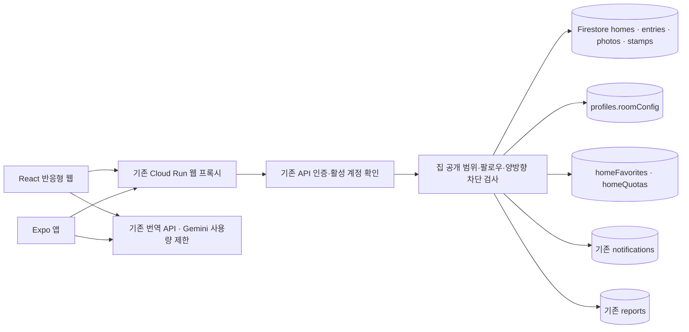

# 친구 집 · 소셜 마이룸

## 진입과 기능

- 웹: 내 프로필의 **내 집 방문·방명록**, **친구 집 둘러보기**, 다른 사용자 프로필의 **집 놀러 가기**. 알림을 누르면 해당 집이 열린다.
- Expo 앱: 프로필 → 친구 집 둘러보기에서 내 집·팔로잉·팔로워·즐겨찾기와 최근 집 알림을 확인한다. 상대 프로필에서도 방문할 수 있다.
- 화이트보드와 사진 액자 3종을 기존 방 꾸미기 편집기에서 이동·뒤집기·제거할 수 있다. 방문 화면에도 설치 버튼이 있다. 가구를 제거해도 방명록·사진 데이터는 삭제하지 않는다.
- 화이트보드: 500자 방명록, 질문 답변, 집주인 답글(수정·비우기), 하트, 한 글 고정, 번역, 삭제, 신고, 차단.
- 질문은 200자. 답변에 당시 질문을 복사하여 질문을 변경해도 맥락이 보존된다.
- 액자: JPG/PNG/WebP를 클라이언트에서 줄여 업로드. 서버 sharp가 실제 이미지 디코딩·재인코딩, 위치/EXIF 제거, 최대 960px·JPEG 300KB 제한. 3개 문서로 분리하여 Firestore 단일 문서 한도를 넘기지 않는다. 160자 설명, 가로/세로/정사각형, 4가지 프레임 색상, 사진별 공개 범위.
- 인사: 집마다 서울 날짜 기준 하루 한 번. 손인사·꽃·엽서·쿠키는 무료이며 결제·재화가 없다. 160자 메모, 받은 선물 하나 전시. 방문자별 가장 최근 인사만 유지한다(누적 방문 이력 아님).
- 상태: 대화 가능·공부 중·음성 대화 희망·휴식 중을 본인이 선택한다. 실제 온라인 접속이나 음성 연결을 의미하지 않는다. 대화 버튼은 기존 서버 DM 정책을 그대로 따른다.

## 공개 범위와 안전 장치

- 집 기본값은 전체 공개(로그인 필요), 글·선물 기본값은 팔로워, 방문자 이름 공개는 꺼짐.
- `followers`: 방문자가 집주인을 팔로우. `mutuals`: 양방향 팔로우. `private`: 집주인만. 사진 공개 범위는 집 공개 범위 안에서 추가로 제한된다.
- 일반 사용자 프로필 API는 타인의 `roomConfig`를 반환하지 않는다. 집 조회 API만 공개·팔로우·양방향 차단을 트랜잭션으로 검증한 뒤 레이아웃·사진·방명록을 반환한다.
- 글쓰기·답글·인사/선물을 합해 사용자별 하루 20개, 15초 간격. 방명록 요청 ID와 하루 인사 키로 재전송 중복을 막는다. 하트는 사용자별 하나이며 토글을 재전송해도 개수가 중복 증가하지 않는다.
- 사진 저장 시도는 집주인별 하루 60회로 제한한다. 이미지 디코딩 전에 영속 한도를 예약하여 잘못된 이미지 반복 전송도 한도를 소비한다.
- 차단된 사람의 방명록·답글·선물은 조회에서 제외된다. 신고도 비공개 사진·숨긴 인사 정보를 읽는 우회 통로가 될 수 없다.
- 본인 글 삭제는 집이 비공개가 되거나 차단된 후에도 API에서 가능하다. 삭제 시 본문·질문·답글을 비우고 고정을 해제한다. 숨겨진 집에서는 삭제 UI에 접근할 수 없으므로 필요하면 기존 신고/CS로 요청해야 한다.
- 신고는 기존 reports 처리 흐름에 저장하며 신고만으로 어느 계정도 정지하지 않는다. 운영 신고 심사·보존/탈퇴 정책은 별도 운영 준비가 필요하다.
- 방문 인사는 집주인에게만 기본 공개된다. 선물을 전시하면 그 선물 작성자와 메모는 방문객에게 보인다. 단순히 집을 여는 행위는 방문 기록으로 저장하지 않는다.

## API와 저장

| 경로 (`/api/homes` 하위) | 동작 |
|---|---|
| `GET /directory?kind=following\|followers\|favorites&cursor=...` | 30개 단위 목록 |
| `GET /:ownerId` | 허용된 집 데이터, 방명록 첫 20개, 최근 인사 20개 |
| `GET /:ownerId/entries?cursor=...` | 방명록 20개 단위 이어보기 |
| `PATCH /:ownerId/settings` | 집주인 설정·질문·고정·선물 전시 |
| `POST /:ownerId/entries` | 글·답변 생성 (화이트보드 설치 필요) |
| `PATCH /:ownerId/entries/:entryId` | 하트 또는 집주인 답글 |
| `DELETE /:ownerId/entries/:entryId` | 집주인/작성자 삭제 |
| `POST /:ownerId/stamp` | 하루 인사·선물 |
| `PUT /:ownerId/favorite` | 즐겨찾기 on/off |
| `PUT /:ownerId/photos/:frameId` | 액자 이미지·설정 저장 |
| `DELETE /:ownerId/photos/:frameId` | 사진 삭제 (가구는 유지) |
| `POST /:ownerId/reports` | 현재 볼 수 있는 글·집주인 답글·사진·인사 신고 (답글은 집주인을 대상으로 접수) |

기존 GCP 프로젝트·Cloud Run 두 서비스·Firestore만 사용한다. 새 공개 버킷, 외부 이미지 URL, AI 이미지 생성, 별도 실시간 서버는 도입하지 않는다. 사진은 문서 내 제한된 JPEG 데이터로 저장하므로 대규모 사용 전 전송/읽기 비용과 비공개 미디어 스토리지 전환을 검토한다. 인앱 알림은 저장되지만 FCM/APNs OS 푸시는 이 구현에 포함되지 않는다.

## 검증

- `npm --prefix backend test`: 실제 Express 라우트를 메모리 Firestore 트랜잭션 double로 호출. 읽기 이후 쓰기 순서, 로그인, 소유권, 공개 범위, 양방향 차단, 원래 질문 보존, 중복 방지, 하트, 선물, 액자 검사/개인정보, 신고, 즐겨찾기 검증. 실제 운영 DB에 테스트 사용자를 만들지 않는다.
- `npm test`: 공유 룸 계약·가구 배치와 JPEG/SVG 삽입 안전성 포함 기존 웹 빌드/회귀 테스트.
- `npm run typecheck`, `npm --prefix mobile run typecheck`, `npm run lint`.
- main 자동 배포는 API·웹 검증과 Expo iOS/Android 번들 검증을 통과해야 진행된다. 네이티브 스토어 배포와 실기기 E2E는 별도다.
